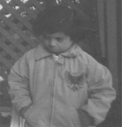

# 影像處理 HW2 ( histogram equalization )

## 基本資料
系級 : 資工 115  
學號 : 41147047S  
作者 : 黃國展  

## 內容
本作業實現了直方圖均衡化技術，通過灰階影像作為參考來調整彩色影像。使用 Gradio 建立 GUI 介面，方便操作和查看結果。

## 使用方法 
1. 雲端使用 ( 建議 )
    - 在以下連結 [link](https://colab.research.google.com/drive/16veZEfA05Bxbfz_D2al3cC_hPK3BP8-T#scrollTo=FCdjMOeYQ_RS) 有 google colab 的雲端 IDE 可供使用，運行所有即可
2. 本地使用 
    - 需要可以運行 jupyter 的 interpreter 
    - 點擊 `./41147047S_影像處理_HW2_彩色.ipynb` 中的運行所有即可

## 測試資料的輸入以及對應輸出

### 心得以及整理
詳情請見 `./41147047S_ip_HW2.pdf`

### 測試 1
輸入:   
輸出:  

原本的 histogram:  
  

後來的 histogram:  
  

### 測試 2
輸入: 
輸出:  

原本的 histogram:  
  

後來的 histogram:  
  

註 : 該檔案由 copilot 協助撰寫