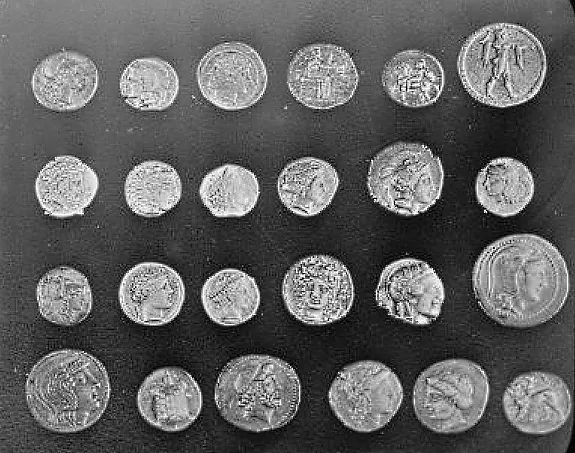

# 影像處理 HW3：平均濾波 / 中值濾波 / Unsharp Masking

此專案實作三種影像處理方式，分別為平均濾波、中值濾波以及 Unsharp Masking，並提供互動式介面讓使用者上傳圖片並調整參數。

## 基本資訊

- 學號：41147047S
- 系級：資工 115
- 姓名：黃國展

## 功能介紹

1. **平均濾波 (Average Filter)**  
   使用指定大小的 Kernel 對影像進行平均濾波，平滑影像細節。

2. **中值濾波 (Median Filter)**  
   使用指定大小的 Kernel 對影像進行中值濾波，減少雜訊。

3. **Unsharp Masking**  
   - 使用平均濾波進行 Unsharp Masking。
   - 使用中值濾波進行 Unsharp Masking。

## 使用方式

1. 啟動程式後，會開啟 Gradio 互動式介面。
2. 上傳圖片，調整 Kernel 大小 ( 僅支援奇數大小的 kernal size ) 及 Unsharp Masking 的 k 值。
3. 查看處理後的影像結果。

## 範例圖片

相關實驗報告請見 `./report.pdf`
以下為範例圖片及其處理結果：

### 範例 1: 測試圖片 (`./image/test_data.png`)

原始圖片：


處理結果：
- 平均濾波 + Unsharp Masking  
  
- 中值濾波 + Unsharp Masking  
  

---

### 範例 2: Coins (`./image/coins.png`)

原始圖片：


處理結果：
- 平均濾波 + Unsharp Masking  
  
- 中值濾波 + Unsharp Masking  
  

## 依賴套件

請確保已安裝以下 Python 套件：
- `opencv-python`
- `numpy`
- `gradio`
- `Pillow`

## 執行方式

1. 確保已安裝所有依賴套件。
2. 執行程式：
   ```bash
   python 41147047S_影像處理_HW3.ipynb
   ```
3. 開啟瀏覽器並使用 Gradio 介面進行操作。

