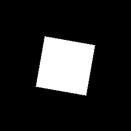

# 影像處理 HW4：影像旋轉插值方法比較

本次實驗比較手動實作與 OpenCV 內建函式在影像旋轉（Rotation）時，不同插值方法的效果差異。主要涵蓋：

- 最近鄰插值（Nearest Neighbor）
- 雙線性插值（Bilinear）

並分別於旋轉角度 **30°** 與 **80°** 下產生結果。

---

## 基本資訊

- 學號：41147047S  
- 系級：資工 115  
- 姓名：黃國展  

---

## 功能介紹

1. **影像旋轉（Rotation）**  
   - 以指定角度將輸入影像旋轉。  
2. **插值方法**  
   - 最近鄰（Nearest Neighbor）  
   - 雙線性（Bilinear）  
3. **實作方式**  
   - **手動（manul）**：使用 NumPy 自行實作反向映射 + 插值計算。  
   - **OpenCV（opencv）**：呼叫 `cv2.warpAffine` 搭配 `INTER_NEAREST` / `INTER_LINEAR`。  

---

## 檔案結構與命名

所有結果圖檔皆存於 `./image/` 資料夾，命名規則為：  
- `<角度>`：30 或 80  
- `<方法縮寫>`：`nn`（Nearest Neighbor）、`bl`（Bilinear）  
- `<實作方式>`：`manul`（手動）、`opencv`（OpenCV）  

## 實驗結果展示

### 30° 旋轉

  
  
  
  

### 80° 旋轉

  
  
  
  
