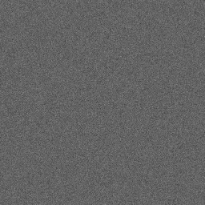
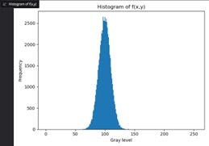
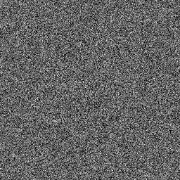
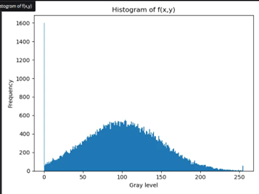

# 影像處理 HW6：Gaussian 雜訊生成與視覺化

**學號：41147047S  
系級：資工 115  
姓名：黃國展**

---

## 一、作業要求

1. **建立** 一張所有像素灰階值均為 100 的影像 \(g(x,y)\)，並顯示該影像。  
2. **依照** Box–Muller 演算法（如課程截圖），產生 μ=0、σ²=25（σ=5）的 Gaussian 雜訊 \(n(x,y)\)，並計算  
   \[
     f(x,y) = g(x,y) + n(x,y)
   \]
   進行上下界裁切（0–255），顯示雜訊影像 \(f(x,y)\)。  
3. **繪製** 影像 \(f(x,y)\) 的直方圖 \(h(i)\)。  
4. **撰寫**對結果的觀察與分析。

---

## 二、專案結構

HW6/  
├── noise_gradio.py      # 主程式：產生雜訊影像並啟動 Gradio 介面  
├── requirements.txt     # 依賴套件列表  
├── README.md            # 本說明檔  
└── image/               # (選填) 範例輸入／輸出圖像與直方圖  

---

## 三、功能介紹

- **Constant Image**  
  建立全 100 灰階影像 \(g(x,y)\)。

- **Gaussian Noise Generation**  
  透過 Box–Muller 演算法為水平相鄰像素對產生一對高斯雜訊 \(z_1, z_2\)，依序填滿整張影像。

- **Noisy Image & Histogram**  
  - 將雜訊加入 \(g(x,y)\) 後進行裁切，得到 \(f(x,y)\)。  
  - 顯示雜訊影像與其灰階直方圖，觀察分佈情形。

- **互動式參數**  
  使用 Gradio 提供調整影像寬、高、σ 的滑桿，並即時更新結果。

---

## 四、範例操作畫面

1. **雜訊影像 sigma=10** \(f(x,y)\)  
    圖片\
    

    分布圖\
    \

2. **雜訊影像 sigma=50** \(f(x,y)\)  
    圖片\
    \
   
    分布圖\
    

---

## 五、結果觀察與分析

- **直方圖分佈**  
  直方圖呈現近似高斯分佈，平均值集中於 100，與理論 μ=0、σ=5 對應後的中心位置吻合。

- **影像效果**  
  雜訊強度與 σ 成正比，σ 越大，影像越「顆粒」；σ 越小，影像越接近純灰階。

- **演算法優缺點**  
  - **優點**：Box–Muller 演算法易於實作，可一次產生成對高斯隨機值。  
  - **缺點**：逐像素迴圈運算包含對數與三角函數，效能較差；建議向量化或使用 NumPy 內建函式優化。

---

## 六、附註

- 本作業以教學為主，並非大規模影像處理系統最佳化；大量影像處理可考慮 GPU 並行或其他隨機數生成方法。  
- 如有任何問題，歡迎與助教或同學討論 : )