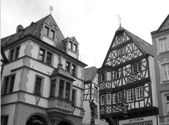
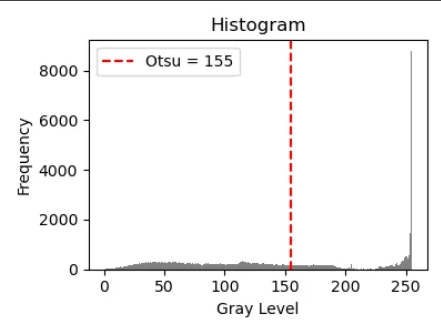
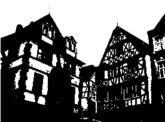

# 影像處理 HW7：Otsu 閾值分割與視覺化

**學號：41147047S  
系級：資工 115  
姓名：黃國展**

---

## 一、作業要求

1. **實作** Otsu 閾值分割法，計算最佳閾值並進行影像二值化。  
2. **繪製** 原影像的灰階直方圖，並標示 Otsu 閾值位置。  
3. **建立** Gradio 互動式介面，允許使用者上傳影像並即時顯示結果。  
4. **撰寫** 對結果的觀察與分析。

---

## 二、專案結構

HW7/  
├── 41147047S_影像處理_HW7.ipynb  # 主程式：包含 Otsu 閾值分割與 Gradio 介面  
├── requirements.txt              # 依賴套件列表  
├── README.md                     # 本說明檔  
└── image/                        # (選填) 範例輸入／輸出圖像與直方圖  

---

## 三、功能介紹

- **Otsu Thresholding**  
  計算影像的灰階直方圖，透過 Otsu 方法自動選取最佳閾值，並進行二值化處理。

- **Histogram Visualization**  
  繪製灰階直方圖，並以紅線標示 Otsu 閾值位置，直觀展示分割效果。

- **Interactive Interface**  
  使用 Gradio 提供互動式介面，允許使用者上傳影像並即時顯示灰階圖、直方圖與二值化結果。

---

## 四、範例操作畫面

1. **原影像與二值化結果**  
    圖片\
    

    直方圖\
    

    二值化結果\
    

---

## 五、結果觀察與分析

- **直方圖分佈**  
  Otsu 閾值能有效分割雙峰分佈的影像，閾值位置通常位於兩峰之間的谷底。

- **影像效果**  
  二值化結果清晰，能準確區分前景與背景；但對於單峰分佈或噪聲較多的影像，效果可能不佳。

- **演算法優缺點**  
  - **優點**：自動化程度高，無需手動調整閾值。  
  - **缺點**：對於多峰分佈或高噪聲影像，可能無法找到理想閾值。

---

