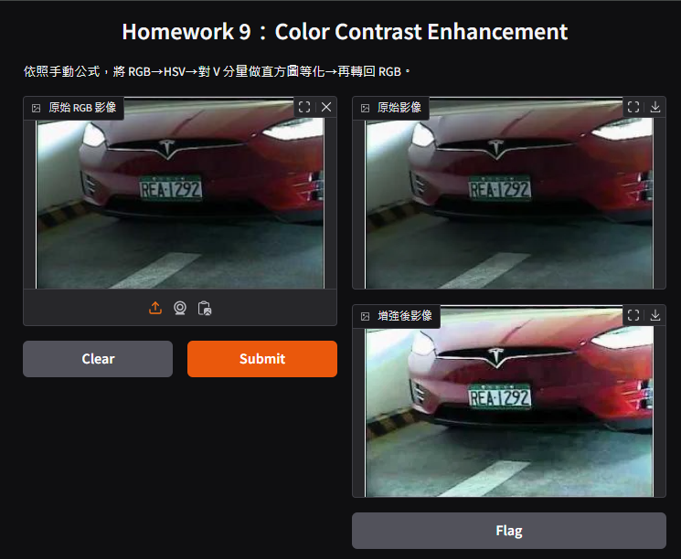
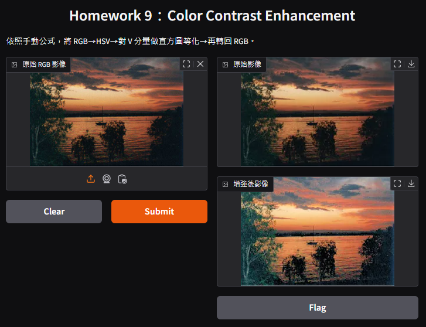

# 影像處理 HW9：色彩對比增強與視覺化

**學號：41147047S  
系級：資工 115  
姓名：黃國展**

---

## 一、作業要求

1. **手動實作** RGB 與 HSV 之間的轉換公式。  
2. **對 V 分量進行直方圖等化**，提升影像對比度。  
3. **建立 Gradio 互動式介面**，即時顯示原始影像與增強後影像。  
4. **撰寫** 對結果的觀察與分析。

---

## 二、專案結構

HW9/  
├── 41147047S_影像處理_HW9.ipynb  # 主程式：包含色彩對比增強與 Gradio 介面  
├── requirements.txt              # 依賴套件列表  
├── README.md                     # 本說明檔  
└── image/                        # (選填) 範例輸入／輸出圖像  

---

## 三、功能介紹

- **RGB/HSV 轉換**  
  以手動公式將 RGB 影像轉換為 HSV，並可逆轉回 RGB。

- **V 分量直方圖等化**  
  針對 HSV 的 V 分量進行直方圖等化，提升整體亮度與對比。

- **互動式介面**  
  使用 Gradio 提供互動式介面，允許使用者上傳影像並即時比較原始與增強後結果。

---

## 四、範例操作畫面

1. **原始影像與增強後影像**  
    執行結果 : \
    
    

---

## 五、結果觀察與分析

- **對比提升效果**  
  增強後影像亮度與對比明顯提升，細節更為清晰。

- **演算法優缺點**  
  - **優點**：能有效提升大部分影像的視覺效果，且流程簡單。  
  - **缺點**：對於本身對比已高或亮度分布極端的影像，可能產生過度增強或失真。

---

